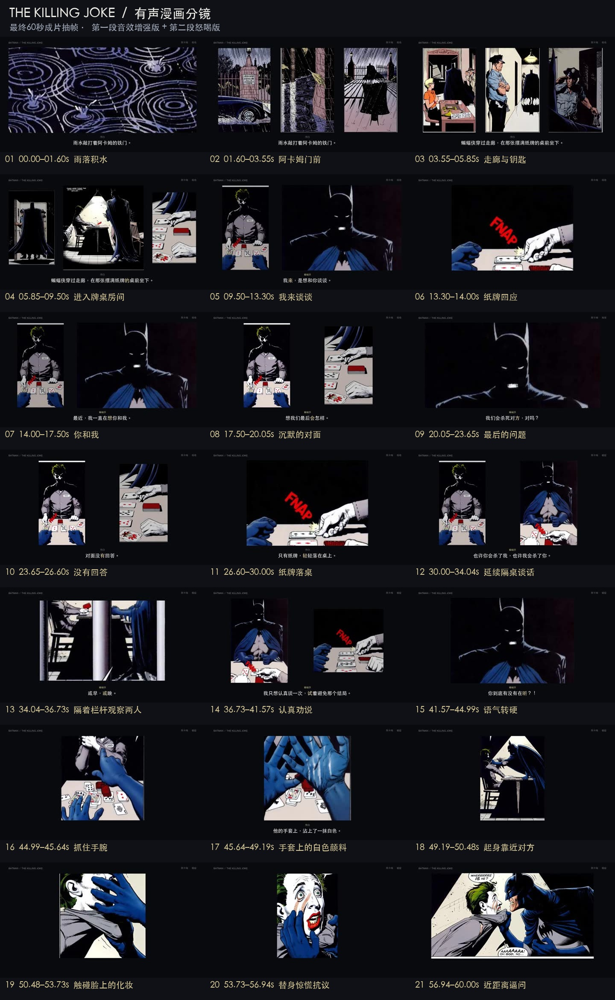

# Batman: The Killing Joke · 有声漫画示例

本例使用用户提供的漫画原稿制作约60秒动态漫画，展示固定角色音色、多角色表演、环境与动作音效、悬疑配乐、原画剪辑和同步字幕。

| 文件 | 内容 |
| --- | --- |
| [source.pdf](source.pdf) | 用户提供的完整漫画原稿 |
| [final.mp4](final.mp4) | 获认可的60秒成片，1920×1080、24fps、H.264/AAC |
| [storyboard.jpg](storyboard.jpg) | 从最终视频按镜头中点抽出的21格分镜图，标注全片时间 |
| [final.zh.srt](final.zh.srt) | 完整中文字幕 |
| [manifest.json](manifest.json) | 文件大小、SHA-256及各镜头时间 |

前30秒使用第一段音效增强版；后30秒使用第二段怒喝版，结束于蝙蝠侠的愤怒逼问。画面取自PDF实际第5–9页，部分对白为时长与叙事节奏而精简改编。

[查看/下载成片](final.mp4)

对应提示词：[第一段](../prompts/scene-cinematic-v2-prompt.txt)、[第二段](../prompts/scene-02-anger-v4-prompt.txt)。原稿、分镜图和成片作为本项目示例收录；其他中间音视频、角色参考录音及凭据不在此目录。
